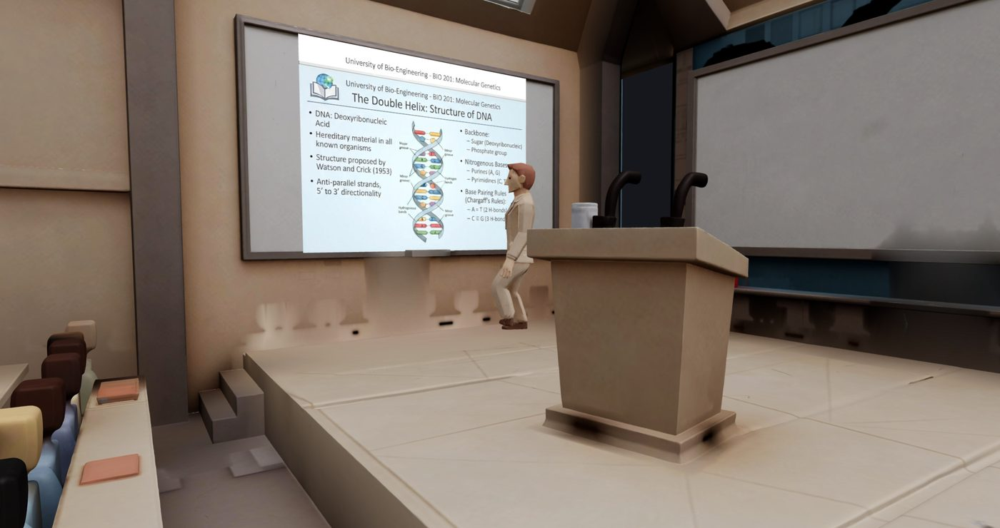
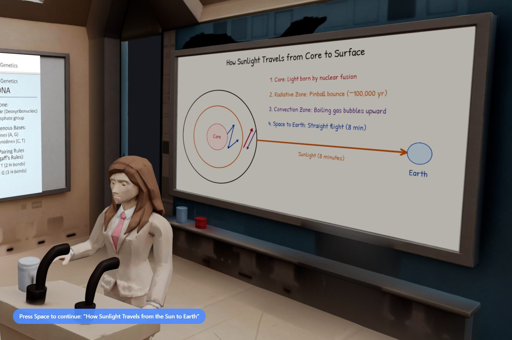

# Uni Simu - learn with AI the hard way

<p align="center"></p>

<p align="center">
  <b>A university-lecture simulator. There is no shortcut: pay attention, and take notes.</b><br>
  <sub>Part of <b>Trinifty</b> - all nifty stuff - all for free.</sub>
</p>

<p align="center">
  <a href="https://www.patreon.com/c/PierreIgorZarebski"></a>
  
</p>

---

## What is it?

You sit in a 3D lecture hall. A professor walks to the board and teaches you **any subject, at any level of difficulty**. They **write and draw on the whiteboard**, show a **slideshow**, and speak to you.

You can **ask questions** at any time. At the end of class you can (and should) **take a picture of your notes for feedback**. It is as simple as that.

<table>
  <tr>
    <td width="50%"><br><sub>A diagram, drawn live, line by line.</sub></td>
    <td width="50%"><br><sub>Master level, in French, with typeset math. "Bravo!"</sub></td>
  </tr>
</table>

## Features

- **Live whiteboard**: diagrams, arrows, curves from functions, boxes and real typeset math (MathJax), drawn stroke by stroke in handwriting.
- **Slideshow mode** with generated slide images and synced speech.
- **Ask questions** (push-to-talk): the professor answers with a new board.
- **Cursus**: ask for a whole course; it plans the parts, teaches them in order and tracks progress.
- **Quizzes** after each lesson.
- **Male or female professor**, rigged and animated in 3D (Three.js), with AI voices and subtitles.
- **Difficulty, duration and thinking-effort dials.**
- **Live cost meter**: see what each lesson costs, in real time.
- **Coursework archive**: lessons are saved; export and import them.
- **English and French.**
- Free demo lectures with a voice cache, so they cost nothing to replay.

## Run it

You need [Node.js](https://nodejs.org/) 20+ and a free [Gemini API key](https://aistudio.google.com/apikey).

```bash
npm install
cp .env.example .env      # then put your GEMINI_API_KEY in it
npm run dev               # http://localhost:5173
```

Production: `npm run build && npm start`. Tests: `npm test`.

All other settings (models, voices, admin panel, support link) are optional and documented in [`.env.example`](.env.example). By default a self-hosted copy has **no limits**.

## How it works

The AI never draws pixels. It returns a **strict JSON lesson spec** (validated against `src/whiteboard/schema.json`), and the app animates it: text, shapes, curves, equations. That keeps boards clean, and means a lesson can be saved, replayed and edited as plain data.

```
server/   Express API: Gemini calls, usage, cursus, coursework
src/      Three.js app, whiteboard engine, i18n, push-to-talk
test/     node --test suites
```

## License

**CC0 1.0: public domain.** Do whatever you like. See [LICENSE](LICENSE). Third-party items keep their own terms: see [NOTICE.md](NOTICE.md).

## Support

If this helped you learn something, consider [becoming a patron](https://www.patreon.com/c/PierreIgorZarebski). More at **[Trinifty](https://github.com/yeme-oss/Trinifty)**.
